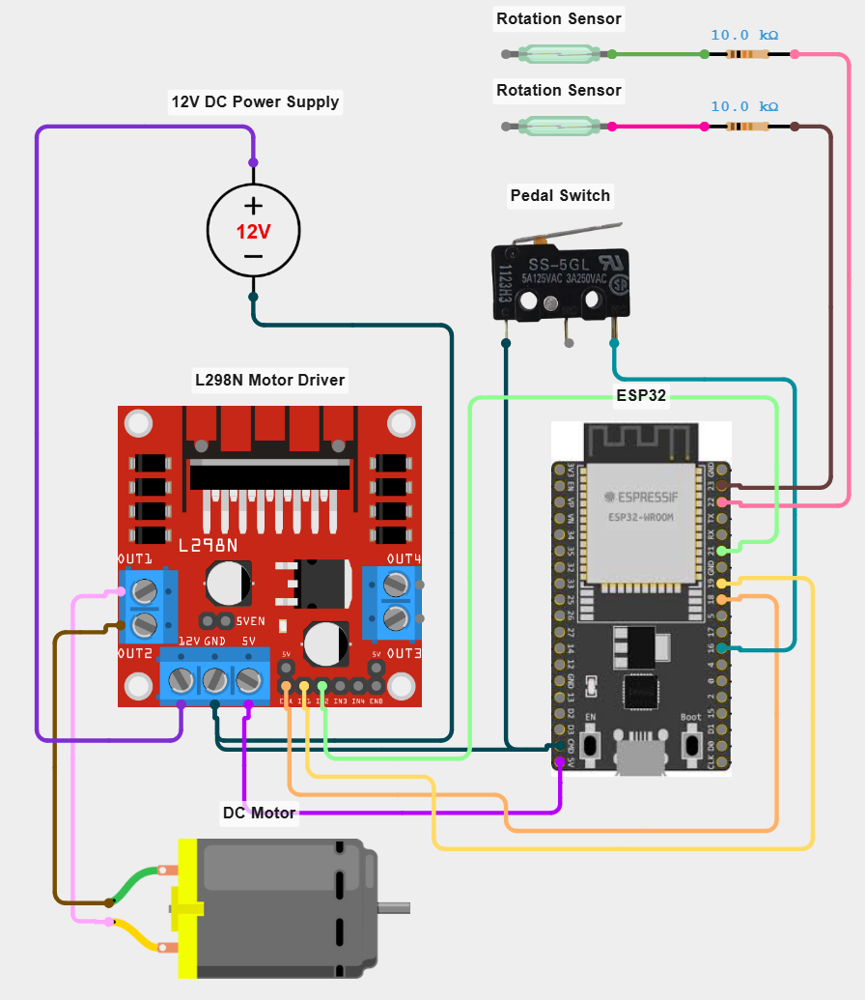

<!--
OpenLitter - Open Source ESP32 Firmware for Litter Robot 1, 2 & 3
Copyright (C) 2024 David Lopes (https://github.com/davdlic)
Licensed under the GNU General Public License v3.0 - see LICENSE
-->

# Wiring diagram

This page shows the default pin map. Every pin is configurable from the Web UI under **Settings → Hardware** — you don't have to follow these exact numbers.

> ⚠️ The Litter Robot motor runs on **12 V**. The ESP32 runs on **3.3 V** logic and is typically powered via a 5 V buck converter. **Never** wire the 12 V rail directly to the ESP32.

## Reference schematic

A reference build of the wiring above is available on Cirkit Designer:

- **Interactive:** [View on Cirkit Designer](https://app.cirkitdesigner.com/project/0bc0578e-28ad-4119-8f88-b2d95e84ed99?view=interactive_preview)
- **Snapshot:** 

> The two "Rotation Sensor" symbols on the schematic are drawn as reed switches and the motor is shown as a generic DC motor. These are **illustrative** — they only represent a 2-wire digital contact and a 12 V DC motor respectively. Use whatever sensors and motor your Litter Robot rebuild actually has (the originals, reeds, Hall ICs, etc.); the firmware doesn't care as long as the electrical interface matches.

## Power

```
  12 V supply ──┬── L298N VS (motor power)
                └── buck converter ── 5 V ── ESP32 VIN / 5V

  GND          common across L298N, ESP32, sensors and switches
```

## ESP32 default pin map

| Function                  | ESP32 pin | L298N / sensor pin     | Notes                                  |
|---------------------------|-----------|------------------------|----------------------------------------|
| Motor IN1                 | GPIO 19   | L298N IN1              | Direction control                      |
| Motor IN2                 | GPIO 21   | L298N IN2              | Direction control                      |
| Motor EN (PWM)            | GPIO 18   | L298N ENA              | Set to `-1` to disable PWM speed ctrl  |
| Hall HOME sensor          | GPIO 22   | Hall sensor 1 OUT      | Detects globe at home position         |
| Hall DUMP sensor          | GPIO 23   | Hall sensor 2 OUT      | Detects globe at inverted position     |
| Cat micro switch          | GPIO 16   | Pedal switch + cable safety in parallel | Switch type configurable: NC or NO |
| HX711 DOUT *(optional)*   | GPIO 34   | HX711 DT               | Input only on ESP32                    |
| HX711 SCK *(optional)*    | GPIO 35   | HX711 SCK              | Input only on ESP32                    |
| LD2410C RX *(optional)*   | GPIO 4    | LD2410C TX             | Note crossover                         |
| LD2410C TX *(optional)*   | GPIO 5    | LD2410C RX             | Note crossover                         |

> GPIOs 34 and 35 are **input-only** on the ESP32 — they're a great match for HX711, but cannot be used for outputs if you ever swap their role.

## L298N → motor

The L298N has two motor channels; OpenLitter only uses channel A.

| L298N pin | Connect to                                       |
|-----------|--------------------------------------------------|
| VS        | +12 V                                            |
| GND       | Common ground                                    |
| 5V (logic) | Either jumper from the on-board 5V regulator, or feed externally if your board has the jumper removed |
| OUT1      | Motor lead 1                                     |
| OUT2      | Motor lead 2                                     |
| IN1       | ESP32 GPIO 19                                    |
| IN2       | ESP32 GPIO 21                                    |
| ENA       | ESP32 GPIO 18 (PWM). Remove the jumper to use PWM. |

Direction is determined by `IN1`/`IN2`:

| IN1 | IN2 | Result        |
|-----|-----|---------------|
| LOW | LOW | Coast (stop)  |
| LOW | HIGH| CCW (cleaning)|
| HIGH| LOW | CW (return)   |
| HIGH| HIGH| Brake         |

## Position sensors (HOME / DUMP)

OpenLitter only needs **two digital inputs** to know where the globe is. Anything that closes a contact (or pulls a line low) when the corresponding magnet on the globe passes by works:

- **Reed switches** with a 10 kΩ pull-up to 3.3 V — what the reference schematic below uses, cheap and reliable.
- **Bipolar latching Hall sensors** (e.g. A3144) with a 10 kΩ pull-up (or `INPUT_PULLUP`) — also fine. Polarity of the magnets matters: one orientation triggers, the other doesn't.
- Original Litter Robot sensors (if you're reusing them) — type depends on the model and revision; treat them as black-box 2-wire digital inputs.

Generic wiring for either family:

```
  3.3 V ── 10 kΩ ──┬── ESP32 GPIO 22 (HOME) or 23 (DUMP)
                   │
                   └── sensor / switch ── GND
```

Configure `Hall active state` in **Settings → Hardware** to match how your sensor signals presence (`LOW` is the most common). The setting is named "Hall" for historical reasons — it applies to reed switches too.

## Pedal micro switch

Use a standard microswitch with COM and either NO or NC contact wired to a GPIO. The other contact goes to GND. The pin uses `INPUT_PULLUP`, so:

- **NC type:** open when cat is on the pedal → GPIO reads HIGH when cat present.
- **NO type:** closed when cat is on the pedal → GPIO reads LOW when cat present.

The firmware inverts the reading automatically based on the **Sensor type** setting.

On most Litter Robot rebuilds the original cable-safety switch (interlock that opens when the front cover is removed) is wired **in parallel** with the pedal microswitch, so either signal stops the cycle. Both contacts land on the same GPIO and the firmware sees a single "cat / unsafe" input.

## Optional: HX711 + 4 load cells

Wire the four 20 kg or 50 kg cells in a Wheatstone bridge (E+, E-, A+, A-) so they sum the load on all four feet:

```
                    ┌─────────────┐
                    │  Cell 1     │
                    │  Cell 2     │  →  E+ / A+ / A- / E- bus
                    │  Cell 3     │
                    │  Cell 4     │
                    └─────────────┘
                          │
            ┌────── HX711 ──── ESP32
            │
            │  Vcc/3.3V, GND, DOUT → GPIO 34, SCK → GPIO 35
```

See [sensors.md](sensors.md) for placement under the Litter Robot feet and calibration.

## Optional: HLK-LD2410C mmWave sensor

```
  3.3 V  ─ VCC
  GND    ─ GND
  TX     ─ ESP32 GPIO 4 (RX)
  RX     ─ ESP32 GPIO 5 (TX)
```

> The defaults used to be GPIO 16/17 (ESP32 UART2). They moved to GPIO 4/5 because GPIO 16 is now the cat micro switch. UART can be remapped to any free GPIO on the ESP32, so this works without code changes.

Mount the sensor in the base, pointing at the entry hole. Tune detection range and sensitivity through the LD2410 mobile app if you have it; the firmware only reads the binary "presence detected" output.

## ASCII overview

```
                      ┌───────────────┐
                      │    ESP32      │
            ┌─────────┤ GPIO 19 ──── IN1 ┐
            │         │ GPIO 21 ──── IN2 ├─── L298N ──── 12V Motor
            │         │ GPIO 18 ──── ENA ┘
            │         │
            │         │ GPIO 16 ──── Cat micro switch + cable safety ── GND
            │         │
            │         │ GPIO 22 ──── Hall HOME ───────── 3.3V/GND
            │         │ GPIO 23 ──── Hall DUMP ───────── 3.3V/GND
            │         │
            │   (opt) │ GPIO 34 ──── HX711 DOUT
            │   (opt) │ GPIO 35 ──── HX711 SCK
            │   (opt) │ GPIO 4  ──── LD2410 TX
            │   (opt) │ GPIO 5  ──── LD2410 RX
            │         └───────────────┘
            │
          5V/GND from buck converter (12V → 5V)
```
